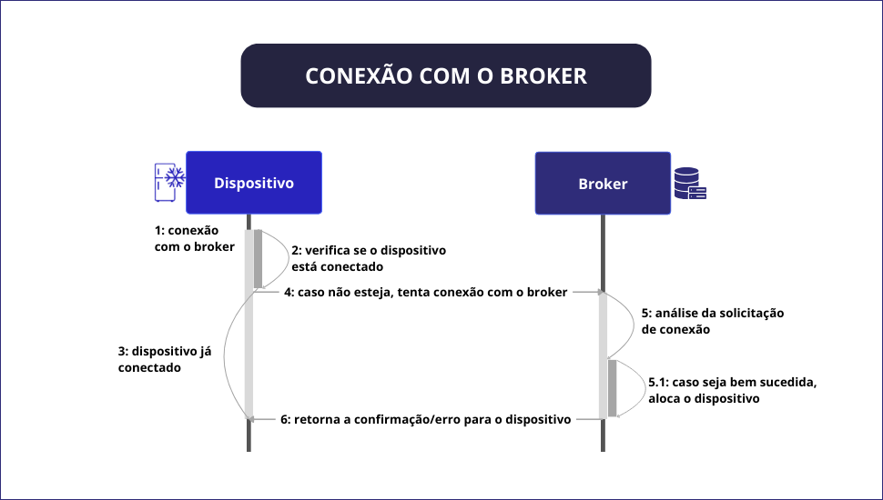
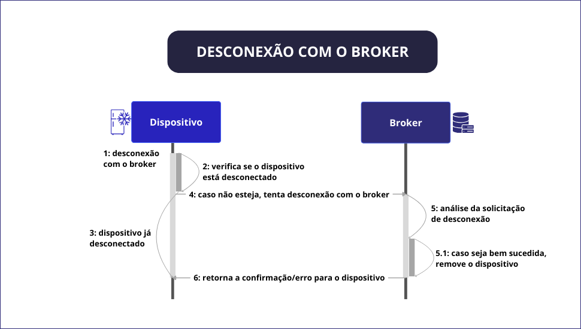
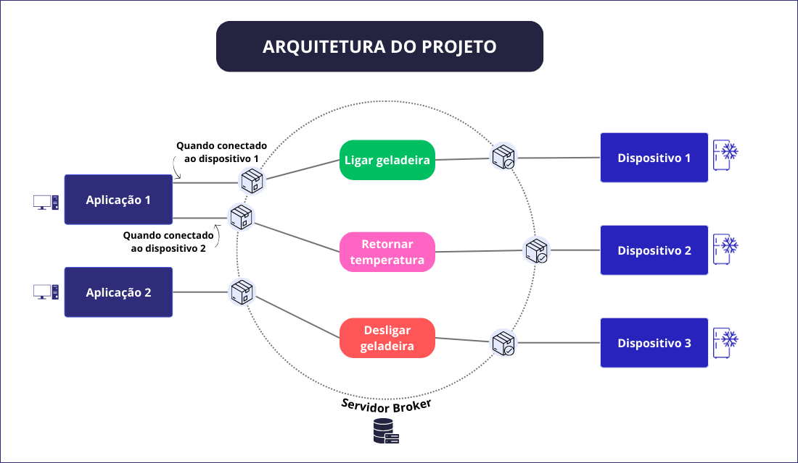
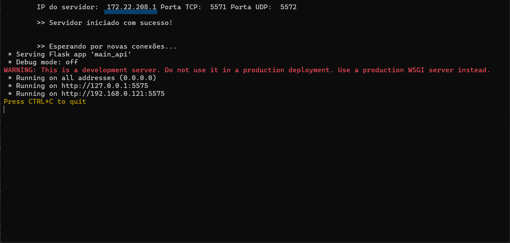

<div align="center">
<h1> 🖥️ </h1>
<h1> Internet das Coisas (IoT, do inglês Internet of Things) </h1>
</div>
<div align="justify">

> Este projeto foi desenvolvido como parte da disciplina MI - Concorrência e Conectividade, do curso de Engenharia de
Computação da Universidade Estadual de Feira de Santana (UEFS).

</div>

<h2> Sumário </h2>
<div id="sumario">
	<ul>
        <li><a href="#descricao-do-projeto"> Descrição do Projeto</a></li>
        <li><a href="#protocolos-de-comunicacao"> Protocolos de Comunicação</a></li>
        <li><a href="#interface-aplicacao"> Interface de Aplicação (REST)</a></li>
        <li><a href="#dispositivo"> Dispositivo</a></li>
        <li><a href="#arquitetura-da-solucao"> Arquitetura da Solução</a></li>
        <li><a href="#execucao-do-projeto">Execução do Projeto</a></li>
        <li><a href="#referencias">Referências</a></li>
    </ul>
</div>


<div id="descricao-do-projeto" align="justify">
    <h2> Descrição do Projeto </h2>

Este projeto consiste num sistema de controle de dispositivos IoT (Internet das Coisas) por meio de uma aplicação, 
que envia comandos para os dispositivos, e um servidor broker, que intermedia a comunicação entre a aplicação e os
dispositivos. O projeto é composto por três componentes principais: a aplicação, o dispositivo e o servidor broker.

A aplicação é responsável por enviar comandos para os dispositivos e receber as respostas deles, por meio do servidor
broker e da API REST. Ela permite ao usuário enviar comandos para os dispositivos, como ligar ou desligar um dispositivo,
adicionar ou remover itens de um dispositivo, entre outros. A aplicação é composta por uma interface CLI (_Command Line 
Interface_), que permite a interação com o sistema por meio de comandos de texto. 

O servidor broker é responsável por intermediar a comunicação entre a aplicação e os dispositivos. Ele recebe as 
mensagens da aplicação, faz um filtro dos dispositivos que devem receber a mensagem e encaminha a mensagem. Além disso,
o servidor broker recebe as respostas dos dispositivos e encaminha para a aplicação. Assim, a aplicação e os 
dispositivos não precisam se comunicar ou saber da existência um do outro, pois toda a comunicação é intermediada pelo
servidor broker. 

Os dispositivos são responsáveis por receber os comandos da aplicação, processá-los e enviar as respostas para a
aplicação, por meio do servidor broker. Eles possuem sua própria interface CLI, que permite ao usuário enviar comandos
para o dispositivo, fazer o processamento deles e retornar as respostas, sem a necessidade de passar pelo intermediário
(servidor broker). Nesse projeto, os dispositivos são representados por uma geladeira, que possui funções como ligar,
desligar, adicionar itens, remover itens, entre outros.

</div>


<div id="protocolos-de-comunicacao" align="justify">
    <h2> Protocolos de Comunicação </h2>

Os protocolos de comunicação são usados para permitir a comunicação entre os dispositivos e a aplicação, e entre os 
dispositivos e o servidor broker. Eles permitem que os componentes, executados em diferentes máquinas, possam
comunicar-se entre si.

O protocolo de comunicação utilizado para a comunicação entre a aplicação e o servidor broker é o HTTP (_Hypertext
Transfer Protocol_), que é um protocolo de comunicação utilizado para a transferência de dados na World Wide Web. O
HTTP é um protocolo de comunicação stateless, o que significa que ele não mantém informações sobre as conexões entre
as requisições. 

Os protocolos de comunicação entre os dispositivos e o servidor broker são baseados em mensagens de texto simples.
Essas mensagens são codificadas em _strings_ e enviadas por conexões TCP/IP (_Transmission Control Protocol_) e 
o UDP (_User Datagram Protocol_). O TCP/IP é um protocolo de comunicação orientado à conexão, que garante a entrega dos
dados na ordem correta e sem perdas. Já o UDP é um protocolo de comunicação não orientado à conexão, que não garante
a entrega dos dados na ordem correta e pode haver perdas.

  <h3> Camada de Aplicação </h3>

A camada de aplicação é a camada mais alta da pilha de protocolos TCP/IP. Ela é responsável por definir a sintaxe e a
semântica das mensagens trocadas, bem como por fornecer serviços de comunicação para as aplicações. Essa camada 
representa a interface entre a aplicação e a rede, e é responsável por garantir que os dados sejam transmitidos de forma
correta e segura.

A conexão entre os dispositivos e o servidor broker é iniciada pelos próprios dispositivos, que ao enviar o comando
para iniciar a conexão com o servidor broker, este responde com um comando de confirmação. Após a confirmação, a
comunicação entre os dispositivos e o servidor broker é estabelecida e os comandos podem ser enviados e recebidos. É 
válido ressaltar que o servidor broker permanece aguardando a conexão dos dispositivos durante sua execução, permanecendo
em um laço infinito até que um dispositivo se conecte e, então, aguarde a conexão de outro dispositivo.

Para a desconexão dos dispositivos, é enviado um comando de desconexão, que é respondido com um comando de confirmação
de desconexão. Após a confirmação, a conexão entre os dispositivos e o servidor broker é encerrada. Caso a aplicação
solicite a visualização de uma lista com os dispositivos conectados, o dispositivo que se desconectou não irá aparecer.

No diagrama abaixo, é representada a comunicação entre o dispositivo e o servidor broker, no caso de um dispositivo 
solicitar a conexão e a desconexão com o broker. 

<p align="center">
    
</p>
<p align="center"><strong> Diagrama da conexão entre o dispositivo e o servidor broker </strong></p>

<p align="center">
    
</p>
<p align="center"><strong> Diagrama da desconexão entre o dispositivo e o servidor broker </strong></p>

  <h3> Camada de Transporte </h3>

A camada de transporte é responsável por fornecer comunicação fim-a-fim entre as aplicações. Ela é responsável por
dividir os dados em segmentos, que são enviados pela rede, e por garantir a entrega dos dados na ordem correta e sem
perdas. No projeto, os protocolos de comunicação utilizados entre os dispositivos e o servidor broker são o TCP/IP e 
o UDP.

A arquitetura TCP/IP foi escolhida para a comunicação entre os dispositivos e o servidor broker, pois ela é amplamente
utilizada na Internet e fornece uma estrutura robusta e confiável para a comunicação entre os dispositivos. Além disso,
por tratar-se dos envios dos comandos para os dispositivos, é necessário que a comunicação seja confiável e segura, o
que é garantido pela arquitetura TCP/IP. Na arquitetura TCP/IP, a camada de transporte é responsável por fornecer 
comunicação entre o dispositivo e o broker.

O protocolo UDP, por outro lado, é usado para transmissões de dados que não requerem confirmação de recebimento.
No projeto, o UDP é usado para enviar os dados de temperatura do dispositivo ao broker. Caso esses dados sejam 
requeridos pela aplicação, eles são enviados de forma contínua, e a perda de alguns desses pacotes não é crítica 
para a aplicação e, portanto, o UDP é uma escolha adequada para esse tipo de comunicação.

A tabela a seguir apresenta os protocolos de comunicação utilizados para a comunicação entre os dispositivos e o
servidor broker, bem como a forma de envio e retorno dos dados: 

<div align="center">

| Solicitante                               | Envio para o broker | Retorno do broker | Formato dos dados |
|-------------------------------------------|---------------------|-------------------|-------------------|
| Dispositivo                               | TCP/IP              | TCP/IP            | String            |                 
| Aplicação (solicitação/mudança dos dados) | HTTP                | UDP               | JSON              |
| Aplicação (outros comandos)               | HTTP                | TCP/IP            | JSON              |
</div>

</div>


<div id="interface-de-aplicacao" align="justify">
    <h2> Interface de Aplicação (REST) </h2>

A interface de aplicação do projeto foi desenvolvida utilizando o protocolo REST (Representational State Transfer),
que é um estilo de arquitetura de _software_ que define um conjunto de restrições para a criação de serviços web.

Essa aplicação é baseada em requisições HTTP, que são feitas a partir de um cliente (neste caso, a aplicação) para o
servidor broker. As requisições do projeto são feitas a partir dos métodos POST e GET, que são utilizados para
enviar e receber dados, respectivamente.

As possíveis resposta para as requisições são: 
- 200: OK, que é a resposta padrão para requisições bem-sucedidas;
- 400: Bad Request, que é a resposta para requisições inválidas;
- 404: Not Found, que é a resposta para requisições que não foram encontradas;
- 500: Internal Server Error, que é a resposta para requisições que causaram um erro no servidor.

A tabela a seguir apresenta as rotas da API REST do projeto, bem como os métodos HTTP utilizados e a descrição de cada
rota:

| Rota                           | Método HTTP | Descrição                                                   |
|--------------------------------|-------------|-------------------------------------------------------------|
| /devices                       | GET         | Retorna todos os dispositivos conectados ao servidor broker |
| /{device_id}/view              | GET         | Retorna os dados de um dispositivo específico               |
| /{device_id}/on                | POST        | Liga um dispositivo específico                              |
| /{device_id}/off               | POST        | Desliga um dispositivo específico                           |
| /{device_id}/change/{new_data} | POST        | Altera os dados de um dispositivo específico                |
| /{device_id}/return            | GET         | Recebe os dados de um dispositivo específico                |
| /{device_id}/add/{data}        | POST        | Adiciona itens a um dispositivo específico                  |
| /{device_id}/remove/{data}     | POST        | Remove itens de um dispositivo específico                   |
| /{device_id}/view_items        | GET         | Retorna os itens de um dispositivo específico               |


Cada função retorna um JSON com os dados solicitados. A seguir, são apresentados exemplos de requisições para cada 
uma das rotas da API REST do projeto apresentadas:

- Requisição para visualizar todos os dispositivos conectados ao servidor broker:
  - Método: GET
  - Rota: /devices
  - Resposta: 
  ``` 
      {
        '172.22.208.1': 
          {
            'ip': '172.22.208.2', 
            'ip_broker': 
            '172.22.208.1', 
            'id': 'GEL01', 
            'temperature': 0.0, 
            'category': 'atuador', 
            'items': {}, 
            'status': 'desligada', 
            'connection': 'conectada', 
            'udp_thread': False, 
            'random_thread': False
          }
       }
  ```

- Requisição para visualizar os dados de um dispositivo específico:
  - Método: GET
  - Rota: /{device_id}/view
  - Resposta: 
  ```
      {
        'ip': '172.22.208.1', 
        'ip_broker': '172.22.208.2', 
        'id': 'GEL01', 
        'temperature': 10.0, 
        'category': 'atuador', 
        'items': {
                  'ovos': 12, 
                  'leite': 5
                  }, 
        'status': 'ligada', 
        'connection': 'conectada', 
        'udp_thread': False, 
        'random_thread': False
      }
  ```

- Requisição para ligar um dispositivo específico:
  - Método: POST
  - Rota: /{device_id}/on
  - Resposta: 
  ```
      {
        'Confirmação: geladeira ligada!'
      }
  ```

- Requisição para desligar um dispositivo específico:
  - Método: POST
  - Rota: /{device_id}/off
  - Resposta: 
  ```
      {
        'Confirmação: geladeira desligada!'
      }
  ```

- Requisição para alterar os dados de um dispositivo específico:
  - Método: POST
  - Rota: /{device_id}/change/{new_data}
  - Resposta: 
  ```
      {
        'Confirmação: temperatura alterada!'
      }
  ```

- Requisição para receber os dados de um dispositivo específico:
  - Método: GET
  - Rota: /{device_id}/return
  - Resposta: 
  ```
      {
        'Confirmação: temperatura atual: 5.75ºC'
      }
  ```

- Requisição para adicionar itens a um dispositivo específico:
  - Método: POST
  - Rota: /{device_id}/add/{data}
  - Resposta: 
  ```
      {
        'Confirmação: item adicionado!'
      }
  ```

- Requisição para remover itens de um dispositivo específico:
  - Método: POST
  - Rota: /{device_id}/remove/{data}
  - Resposta: 
  ```
      {
        'Confirmação: item removido!'
      }
  ```

- Requisição para visualizar os itens de um dispositivo específico:
  - Método: GET
  - Rota: /{device_id}/view_items
  - Resposta: 
  ```
      {
      'ITENS NA GELADEIRA:'
        '- beterraba: 2 unidades'
      }
  ```
 
</div>

<div id="dispositivo">
  <h2> Dispositivo </h2>
  
O dispositivo do projeto é uma geladeira, que possui funções como ligar, desligar, adicionar itens, remover itens,
entre outros. O dispositivo é responsável por receber os comandos da aplicação, processá-los e enviar as respostas para
a aplicação, por meio do servidor broker. Ele possui sua própria interface CLI, que permite ao usuário enviar comandos
para o dispositivo, fazer o processamento deles e retornar as respostas, sem a necessidade de passar pelo intermediário
(servidor broker).

O dispositivo é composto por três arquivos principais: `connection.py`, `fridge.py` e `main_device.py`. Abaixo, são
apresentadas as funcionalidades de cada um dos arquivos do dispositivo:

  <h3> Arquivo "connection.py" </h3>
 
O arquivo `connection.py` é responsável por lidar com as conexões TCP/IP e UDP do dispositivo, bem como a conexão com o
servidor broker. Ele é responsável por enviar e receber mensagens, manter a conexão ativa e encerrar a conexão. Além
disso, ele é responsável por manter a comunicação entre o dispositivo e o servidor broker, por meio dos protocolos TCP/IP
e UDP.

  <h3> Arquivo "fridge.py" </h3>
  
O arquivo `fridge.py` é responsável por manter o estado e as operações do dispositivo (geladeira). Ele possui funções
como ligar, desligar, adicionar itens, remover itens, entre outros. Além disso, ele é responsável por manter os dados
do dispositivo, como a temperatura, os itens presentes na geladeira, entre outros.

  <h3> Arquivo "main_device.py" </h3>

O arquivo `main_device.py` é o ponto de entrada do dispositivo. Ele é responsável por inicializar o dispositivo e
apresentar a interface CLI do dispositivo, que permite ao usuário enviar comandos para o dispositivo, fazer o
processamento deles e retornar as respostas. 

Na tabela a seguir, são apresentadas as funções do dispositivo, bem como a descrição de cada uma delas:

| Número | Função                | Descrição                                              |
|--------|-----------------------|--------------------------------------------------------|
| 1      | view_data()           | Retorna o dicionário com os dados do dispositivo       |
| 2      | turn_on_fridge()      | Muda o estado da geladeira para "ligada"               |
| 3      | turn_off_fridge()     | Muda o estado da geladeira para "desligada"            |
| 4      | change_temperature()  | Muda a temperatura do dispositivo                      |
| 5      | check_random_thread() | Verifica a thread para a criação de valores randômicos |
| 6      | connect_broker()      | Conecta o dispositivo com o Broker                     |
| 7      | disconnect_broker()   | Desconecta o dispositivo do Broker                     |
| 8      | set_fridge_id()       | Coloca o ID no dispositivo                             |
| 0      | close_program()       | Fecha o terminal do dispositivo                        |


Além disso, o dispositivo pode ser acessado de forma remota, por meio da aplicação, tendo quase todas as funções que 
o próprio dispositivo tem, exceto gerar os valores randomicos. A seguir, são apresentadas as funções do dispositivo na
aplicação, bem como a descrição de cada uma delas: 

| Número | Função                | Descrição                                                     |
|--------|-----------------------|---------------------------------------------------------------|
| 1      | view_fridge_device()  | Retorna o dicionário com os dados do dispositivo              |
| 2      | turn_on_device()      | Retorna a confirmação que a geladeira foi ligada              |
| 3      | turn_off_device()     | Retorna a confirmação que a geladeira foi desligada           |
| 4      | change_data_device()  | Retorna a confirmação da mudança de temperatura               |
| 5      | receive_data_device() | Retorna a temperatura atual do dispositivo                    |
| 6      | add_item_device()     | Retorna a confirmação da adição do item, caso seja possível   |
| 7      | remove_item_device()  | Retorna a confirmação da remoção do item, caso seja possível  |
| 8      | view_items_device()   | Retorna os itens presentes na geladeira                       |

</div>


<div id="arquitetura-de-solucao" align="justify">
  <h2> Arquitetura de Solução </h2>
  
A arquitetura do projetpo foi desenvolvida no intuito de permitir a comunicação entre dispositivos, aplicação e um
servidor broker. Dessa forma, é possível que a aplicação envie comandos para os dispositivos, que por sua vez, enviam
respostas para a aplicação, por meio de um intermediário, o servidor broker. A arquitetura do projeto é composta
por três módulos principais: 'application', 'device' e 'server'. Cada um desses módulos é responsável por uma parte
da comunicação. A seguir, são apresentadas as funcionalidades de cada um dos módulos.

  <h3> Módulo "Application" </h3>

O módulo 'application' é responsável por enviar comandos para os dispositivos e receber as respostas dos dispositivos,
ou seja, tratam da lógica do cliente da aplicação. Para isso, a aplicação é composta por uma interface CLI 
(_Command Line Interface_) -- um tipo de interface de usuário que permite a interação com o sistema por meio de 
comandos de texto --, que permite ao usuário enviar comandos para os dispositivos. Há a interação com a API REST
para controlar os dispositivos.

A aplicação é composta pelos seguintes arquivos:
- `application/main_app.py`: este arquivo principal da aplicação. É o ponto de entrada da aplicação, fazendo a 
solicitação ao usuário do IP do servidor, e então chama a função menu_application(), no arquivo `menu.py`, que exibe
o menu de opções da aplicação;
- `application/menu.py`: este arquivo contém a lógica do menu da aplicação. Ele apresenta as opções de comandos que
podem ser enviados para os dispositivos, como visualizar os dispositivos conectados, ligar ou desligar um dispositivo,
entre outros;
- `application/device.py`: este arquivo contém as funções relacionadas ao dispositivo, como a função de visualizar os
dispositivos conectados e os dados de um dispositivo específico;
- `application/api.py`: este arquivo contém as funções que interagem com a API REST para o controle dos dispositivos.
Ele tem funções para obter todos os dispositivos conectados, ligar um dispositivo, desligar um dispositivo, entre 
outros; 

A aplicação é composta por um arquivo `main_app.py`, que é responsável por inicializar a aplicação e estabelecer a
comunicação com o servidor broker. Além disso, a aplicação é composta por um arquivo `menu.py`, que é responsável por
exibir o menu de opções da aplicação e permitir ao usuário enviar comandos para os dispositivos. Um outro arquivo
é o `device.py`, que é responsável por conter as funções relacionadas ao dispositivo, como a função de visualizar
os dispositivos conectados. Por fim, o arquivo `api.py` contem as funções relacionadas à comunicação com a API do
servidor broker (REST). 

  <h3> Módulo "Device" </h3>

O módulo 'device' é responsável por lidar com as operações e funcionalidades do dispositivo. O dispositivo é capaz 
de receber comandos da aplicação, de forma remota, processá-los e enviar respostas para a aplicação, por meio do 
servidor broker. 

Além disso, o dispositivo possui sua própria interface CLI, que permite ao usuário enviar comandos para o 
dispositivo, fazer o processamento deles e retornar as respostas, sem a necessidade de passar pelo intermediário, o
servidor broker. 

O dispositivo é composto pelos seguintes arquivos:
- `connection.py`: este arquivo lida com as conexões TCP e UDP, que são utilizadas para a comunicação entre o
dispositivo e o servidor broker, incluindo o envio e o recebimento de mensagens;
- `device/fridge.py`: este arquivo mantém o estado e as operações do dispositivo (geladeira), como ligar, desligar,
adicionar itens, remover itens, entre outros;
- `device/main_device.py`: este arquivo principal do dispositivo. É o ponto de entrada do dispositivo, fazendo a
solicitação ao usuário do IP do servidor, e então chama a função menu_fridge(), que exibe o menu de opções do
dispositivo;

  <h3> Módulo "Server" </h3>

O módulo 'server' é responsável por intermediar a comunicação entre a aplicação e os dispositivos. O servidor broker
é responsável por receber as mensagens da aplicação, encaminhá-las para os dispositivos, receber as respostas dos
dispositivos e encaminhá-las para a aplicação. Ele é responsável por receber a conexão dos dispositivos.

O servidor broker é composto pelos seguintes arquivos:
- `server/main_api.py`: este arquivo principal do servidor broker. Ele é responsável por criar a API REST que se 
comunica com o broker e com o usuário. Ele usa o FLask, um microframework web em Python, para criar as rotas que
podem ser acessadas para interagir com os dispositivos;
- `server/broker.py`: este arquivo lida com a criação do servidor broker, que é responsável por intermediar a 
comunicação entre a aplicação e os dispositivos;
- `server/broker_connections.py`: este arquivo lida com as conexões dos dispositivos, incluindo o envio e o recebimento
de mensagens, e a manutenção das conexões ativas;

Abaixo, tem-se a arquitetura do projeto, que ilustra a comunicação entre a aplicação, o servidor broker e os dispositivos:

<p align="center">
    
</p>
<p align="center"><strong> Arquitetura do projeto de IoT </strong></p>

  
  <h3> Conexões Simultâneas </h3>
  
As Threads são linhas de execução independentes, nas quais é possível executar conexões de forma simultânea, sem uma
interferir de forma direta na outra. 

No projeto, as threads foram usadas no servidor broker e nos dispositivos. No broker, as threads foram usadas para 
o recebimento dos dados via TCP/IP e para o recebimento dos dados via UDP. Uma outra thread, usada no projeto, é para
a conexão com os dispositivos. Essa thread é criada toda vez que um novo dispositivo é conectado, e fica aguardando a
conexão com um dispositivo. 

De forma resumida, as threads do servidor broker são: 
- `tcp_thread`: responsável por receber os dados via TCP/IP;
- `udp_thread`: responsável por receber os dados via UDP;
- `connection_thread`: responsável por aguardar a conexão com os dispositivos.

Já nos dispositivos as threads foram usadas para receber os dados via TCP e para enviar os dados via UDP. Uma outra
thread é a geração dos valores da temperatura, de forma randômica, estando no intervalo de -18 a 4. Portanto, as 
threads são:

- `tcp_thread`: responsável por receber os dados via TCP;
- `udp_thread`: responsável por enviar os dados via UDP;
- `random_thread`: responsável por gerar os valores randômicos da temperatura.

O intuito de usar as threads foi para que as conexões pudessem ser feitas de forma simultânea, sem que uma interferisse
na outra. Dessa forma, é possível que o servidor broker receba os dados via TCP/IP e via UDP, e que os dispositivos
recebam os dados via TCP e enviem os dados via UDP, de forma simultânea. 

  <h3> Desempenho e Concorrência </h3>
  
Alguns mecanismos foram utilizados para melhorar o tempo de resposta para a aplicação. Um desses mecanismos foi a
utilização de threads, que permitem a execução de conexões simultâneas, sem que uma interfira na outra. Além disso,
foi feito o controle de concorrência, por meio de flags, para garantir que os dados sejam enviados na ordem correta
e sem perdas.

  <h3> Confiabilidade </h3>
  
Com relação a confiabilidade, o projeto foi testado para verificar se ele é capaz de lidar com falhas de conexão, como
a retirada do cabo de rede de um dos nós. O projeto foi capaz de lidar com essas falhas, mantendo a comunicação entre
os dispositivos e a aplicação, com o processo manual para a reconexão. 

Para a retirada do cabo de rede da aplicação, caso o usuário solicite uma das opções do menu, será apresentado um erro
informando que não foi possível fazer a conexão entre a aplicação com o Broker. Caso o usuário continue tentando, o
mesmo erro continuará sendo apresentado. Ao conectar novamente o cabo de rede e esperar 30 segundos para a detecção de
conexão, os comandos solicitados serão executados normalmente.

Para a retirada do cabo de rede do dispositivo, caso o usuário solicite uma das opções do menu, será informado que não
pode ter conexão, ou seja, não há rede para que os comandos sejam enviados ao Broker. Caso o usuário continue tentando,
o mesmo erro continuará sendo apresentado. Ao conectar novamente o cabo de rede e esperar 30 segundos para a detecção de
conexão, os comandos solicitados serão executados normalmente.

Por fim, para a retirada do cabo de rede do broker, caso o usuário solicite uma das opções tanto da aplicação quanto do
dispositivo, serão informados os erros descritos acima.
  
</div>


<div id="docker" align="justify">
  <h2> Docker </h2>

O Docker é uma plataforma de código aberto que permite a criação, execução e gerenciamento de aplicativos em containers.
No projeto, o Docker foi utilizado para facilitar a execução do projeto, sem a necessidade de instalar as dependências
do projeto na máquina. Além disso, o Docker permite a execução do projeto em diferentes ambientes, sem a necessidade
de instalar as dependências em cada um deles. 

</div>


<div id="execucao-do-projeto" align="justify">
    <h2> Execução do Projeto </h2>

O projeto pode ser executado com ou sem a utilização do _Docker_. A execução com o Docker é mais simples, 
pois não é necessário instalar as dependências do projeto na máquina. Por outro lado, requer que o usuário
tenha o _Docker_ instalado na sua máquina. 

<h3> Obtenção do Repositório </h3>

Para a execução do projeto, caso possua o _Git_ instalado na sua máquina, deve-se clonar o repositório através 
desse [link](https://github.com/Samara-Ferreira/PBL-Redes.git). Após clonar o repositório, basta acessar os diretórios
de cada um dos componentes do projeto com os comandos, em terminais diferentes:

```
cd application
```

```
cd device
```

```
cd server
```

Caso não tenha o _Git_ instalado na sua máquina, é possível baixar o projeto em formato _zip_ e 
descompactá-lo. Em seguida, segue-se os mesmos passos descritos acima para o acesso aos diretórios de  cada 
um dos módulos.

Abaixo, são apresentadas as instruções para a execução do projeto com e sem o Docker.

  <h3> Execução sem o Docker </h3>

A seguir são apresentadas as instruções para a execução do projeto com e sem a utilização do _Docker_.

    <h4> Pré-requisitos </h4>

Para a execução do projeto sem o _Docker_, é necessário ter instalados na máquina as seguintes ferramentas:
- Python 3.8 ou superior;
- Pip, para instalação das dependências do projeto;
- Bibliotecas do Python, como a _Flask_ e a _requests_, listadas no arquivo `requirements.txt` dos módulos ``application`` 
e ``server``;

    <h4> Instalação das Dependências </h4>

Para instalar as dependências do projeto, acesse o diretório de cada um dos módulos do projeto e execute o seguinte
comando:

```
pip install -r requirements.txt
```
 
É possível também a instalação das dependências manualmente, através dos comandos no terminal:

```
pip install Flask
```

```
pip install requests
```

<h4> Execução dos Módulos </h4>

Para a execução dos módulos, é necessário navegar por cada um dos diretórios e executar o arquivo
`main.py` de cada um deles, sendo:
- No módulo ``application``, execute o comando: `python3 main_app.py`;
- No módulo ``device``, execute o comando: `python3 main_device.py`;
- No módulo ``server``, execute o :comando `python3 main_api.py`.

Após a execução dos comandos, os componentes serão executados. Para a comunicação entre os módulos, é necessário que
o usuário atente-se ao pedido do endereço do protocolo de _internet_ (_ip, internet protocol_) do servidor broker,
solicitado ao inicializar a aplicação e os dispositivos. Esse endereço _ip_ pode ser visualizado assim que o servidor 
é inicializado, como pode ser visualizado na imagem a seguir. Dessa forma, é recomendável a execução primeiramente do 
servidor, pois é necessário que o usuário insira esse endereço de forma manual.

<p align="center">
    
</p>
<p align="center"><strong> Inicialização do servidor </strong></p>


  <h3> Execução com o Docker </h3>
  
Para a execução do projeto com o Docker, tem-se duas opções: a execução com o _Docker Hub_ e a execução sem o _Docker 
Hub_. A execução com o _Docker Hub_ é mais simples, pois não é necessário a criação das imagens dos módulos do projeto.

    <h4> Execução sem o Docker Hub </h4>

Para essa execução, é necessário acessar o diretório de cada um dos componentes do projeto e executar o seguinte comando:

```
docker build -t <nome_da_imagem> .
```

No qual `<nome_da_imagem>` é o nome que será dado à imagem do módulo. Para os módulos _"application"_, _"device"_ e 
_"server"_, tende-se os seguintes comandos:

```
docker build -t application .
```
    
```
docker build -t device .
```
    
```
docker build -t server .
```

Após a execução do comando, a imagem do módulo será criada. Em seguida, execute o seguinte comando para a execução
do container:

```
docker run -p port:port -iti <nome_da_imagem>
```

No qual _"port"_ é a porta que será utilizada para a comunicação entre o container e a máquina host. Tendo isso em 
mente, a execução do container para o módulos módulos são:

- Para _"application"_, tem-se: 
```
docker run -p 5575:5575 -iti application
```
- Para _"device"_, tem-se: 
```
docker run -p 5571:5571 -p 5572:5572/udp -iti device
```
- Para _"server"_, tem-se:
```
docker run -p --network host -iti broker
```

    <h4> Execução com o Docker Hub </h4>
    
Para a execução do projeto com o _Docker Hub_, primeiramente é necessário obter as imagens dos módulos do projeto. Para
isso, execute os seguintes comandos:
  
    ```
    docker pull samara-ferreira/tec502-iot:application
    docker pull samara-ferreira/tec502-iot:device
    docker pull samara-ferreira/tec502-iot:broker
    ```

Agora, para a execução do projeto, execute os seguintes comandos:

    ```
    docker run -p samarasf/tec502-iot:broker --network host
    docker run -p samarasf/tec502-iot:device
    docker run -p samarasf/tec502-iot:application
    ```

</div>


<div id="referencias" align="justify">
    <h2> Referências </h2>

UNIVERSIDADE FEDERAL DO RIO DE JANEIRO. MQTT. Disponível em: <https://www.gta.ufrj.br/ensino/eel878/redes1-2019-1/vf/mqtt/>. Acesso em: [data de acesso].

RAULINO, Filipe. Modelo de Arquitetura TCP/IP. Disponível em: <https://docente.ifrn.edu.br/filiperaulino/disciplinas/info4m/redes-de-computadores-e-aplicacoes/aulas/4_modeloArqTCP_IP.pdf>. Acesso em: [data de acesso].
</div>