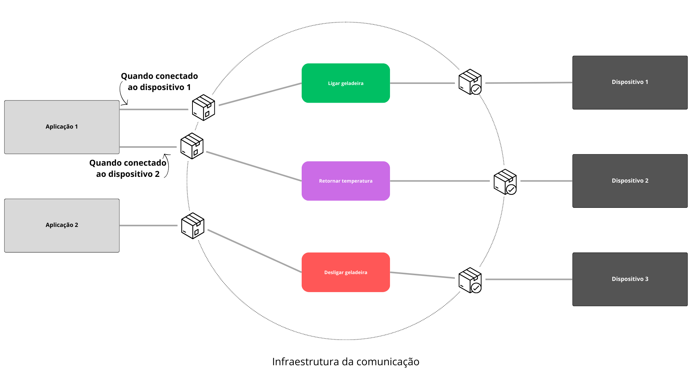

<div align="center">

<h1> 🖥️ </h1>
<h1> Internet das Coisas (IoT, do inglês Internet of Things) </h1>
</div>

<div align="justify">

> Este projeto foi desenvolvido como parte da disciplina MI - Concorrência e Conectividade, do curso de Engenharia de
Computação da Universidade Estadual de Feira de Santana (UEFS).

</div>

<h2> Sumário </h2>
<div id="sumario">
	<ul>
        <li><a href="#descricao"> Descrição do Projeto</a></li>
        <li><a href="#execucao-do-projeto">Execução do Projeto</a></li>
    </ul>
</div>


<div id="descricao">
    <h2> Descrição do Projeto </h2>
</div>

<div align="justify">

Este projeto consiste em um sistema de controle de dispositivos IoT (Internet das Coisas) por meio de uma aplicação, 
que envia comandos para os dispositivos, e um servidor broker, que intermedia a comunicação entre a aplicação e os
dispositivos. O projeto é composto por três componentes principais: a aplicação, o dispositivo e o servidor broker.

O servidor broker é responsável por intermediar a comunicação entre a aplicação e os dispositivos. Ele recebe as 
mensagens da aplicação, faz um filtro dos dispositivos que devem receber a mensagem e encaminha a mensagem. Além disso,
o servidor broker recebe as respostas dos dispositivos e encaminha para a aplicação. Assim, a aplicação e os 
dispositivos não precisam se comunicar ou saber da existência um do outro, pois toda a comunicação é intermediada pelo
servidor broker. 

A imagem abaixo ilustra a infraestrutura da comunicação entre a aplicação, o servidor broker e os dispositivos:

<p align="center">
    
</p>

</div>


<h2> Arquitetura de Solução </h2>

<div align="justify">

A arquitetura do projetpo foi desenvolvida no intuito de permitir a comunicação entre dispositivos, aplicação e um 
servidor broker. Dessa forma, é possível que a aplicação envie comandos para os dispositivos, que por sua vez, enviam
respostas para a aplicação, por meio de um intermediário, que é o servidor broker. A arquitetura do projeto é composta 
por três módulos principais: 'application', 'device' e 'server'. Cada um desses módulos é responsável por uma parte 
da comunicação. A seguir, são apresentadas as funcionalidades de cada um dos módulos.

<h3> Módulo "Application" </h3>

O módulo 'application' é responsável por enviar comandos para os dispositivos e receber as respostas dos dispositivos,
ou seja, tratam da lógica do cliente da aplicação. Para isso, a aplicação é composta por uma interface CLI 
(Command Line Interface) -- um tipo de interface de usuário que permite a interação com o sistema por meio de 
comandos de texto --, que permite ao usuário enviar comandos para os dispositivos. Há a interação com a API REST
para controlar os dispositivos.

A aplicação é composta pelos seguintes arquivos:
- `application/main_app.py`: este arquivo principal da aplicação. É o ponto de entrada da aplicação, fazendo a 
solicitação ao usuário do IP do servidor, e então chama a função menu_application(), no arquivo `menu.py`, que exibe
o menu de opções da aplicação;
- `application/menu.py`: este arquivo contém a lógica do menu da aplicação. Ele apresenta as opções de comandos que
podem ser enviados para os dispositivos, como visualizar os dispositivos conectados, ligar ou desligar um dispositivo,
entre outros;
- `application/device.py`: este arquivo contém as funções relacionadas ao dispositivo, como a função de visualizar os
dispositivos conectados e os dados de um dispositivo específico;
- `application/api.py`: este arquivo contém as funções que interagem com a API REST para o controle dos dispositivos.
Ele tem funções para obter todos os dispositivos conectados, ligar um dispositivo, desligar um dispositivo, entre 
outros; 

A aplicação é composta por um arquivo `main_app.py`, que é responsável por inicializar a aplicação e estabelecer a
comunicação com o servidor broker. Além disso, a aplicação é composta por um arquivo `menu.py`, que é responsável por
exibir o menu de opções da aplicação e permitir ao usuário enviar comandos para os dispositivos. Um outro arquivo
é o `device.py`, que é responsável por conter as funções relacionadas ao dispositivo, como a função de visualizar
os dispositivos conectados. Por fim, o arquivo `api.py` contem as funções relacionadas à comunicação com a API do
servidor broker (REST). 

<h3> Módulo "Device" </h3>

O módulo 'device' é responsável por lidar com as operações e funcionalidades do dispositivo. O dispositivo é capaz 
de receber comandos da aplicação, de forma remota, processá-los e enviar respostas para a aplicação, por meio do 
servidor broker. 

Além disso, o dispositivo possui sua própria interface CLI, que permite ao usuário enviar comandos para o 
dispositivo, fazer o processamento deles e retornar as respostas, sem a necessidade de passar pelo intermediário, o
servidor broker. 

O dispositivo é composto pelos seguintes arquivos:
- `connection.py`: este arquivo lida com as conexões TCP e UDP, que são utilizadas para a comunicação entre o
dispositivo e o servidor broker, incluindo o envio e o recebimento de mensagens;
- `device/fridge.py`: este arquivo mantém o estado e as operações do dispositivo (geladeira), como ligar, desligar,
adicionar itens, remover itens, entre outros;
- `device/main_device.py`: este arquivo principal do dispositivo. É o ponto de entrada do dispositivo, fazendo a
solicitação ao usuário do IP do servidor, e então chama a função menu_fridge(), que exibe o menu de opções do
dispositivo;


<h3> Módulo "Server" </h3>

O módulo 'server' é responsável por intermediar a comunicação entre a aplicação e os dispositivos. O servidor broker
é responsável por receber as mensagens da aplicação, encaminhá-las para os dispositivos, receber as respostas dos
dispositivos e encaminhá-las para a aplicação. Ele é responsável por receber a conexão dos dispositivos.

O servidor broker é composto pelos seguintes arquivos:
- `server/main_api.py`: este arquivo principal do servidor broker. Ele é responsável por criar a API REST que se 
comunica com o broker e com o usuário. Ele usa o FLask, um microframework web em Python, para criar as rotas que
podem ser acessadas para interagir com os dispositivos;
- `server/broker.py`: este arquivo lida com a criação do servidor broker, que é responsável por intermediar a 
comunicação entre a aplicação e os dispositivos;
- `server/broker_connections.py`: este arquivo lida com as conexões dos dispositivos, incluindo o envio e o recebimento
de mensagens, e a manutenção das conexões ativas;

</div>


<div id="#protocolos-de-comunicacao">
    <h2> Protocolos de Comunicação </h2>
</div>

Os protocolos de comunicação são usados para permitir a comunicação entre os dispositivos e a aplicação, e entre os 
dispositivos e o servidor broker. Eles permitem que os componentes sendo executados em diferentes máquinas possam
comunicar-se entre si.

O protocolo de comunicação utilizado para a comunicação entre a aplicação e o servidor broker é o HTTP (Hypertext
Transfer Protocol), que é um protocolo de comunicação utilizado para a transferência de dados na World Wide Web. O
HTTP é um protocolo de comunicação stateless, o que significa que ele não mantém informações sobre as conexões entre
as requisições. 

Os protocolos de comunicação entre os dispositivos e o servidor broker são baseados em mensagens de texto simples.
Essas mensagens são codificadas em strings e enviadas através de conexões TCP/IP (Transmission Control Protocol) e 
o UDP (User Datagram Protocol). O TCP é um protocolo de comunicação orientado à conexão, que garante a entrega dos
dados na ordem correta e sem perdas. Já o UDP é um protocolo de comunicação não orientado à conexão, que não garante
a entrega dos dados na ordem correta e pode haver perdas.

<h3> Camada de Aplicação </h3>

Na arquitetura TCP/IP, a usada entre o servidor broker e os dispositivos, a camada de aplicação é a camada mais
alta da pilha de protocolos. Ela é responsável por definir a sintaxe e a semântica das mensagens trocadas, bem como
por fornecer serviços de comunicação para as aplicações. 

A comunicação entre os dispositivos e o Broker é iniciada pelo próprio servidor broker, que envia um comando específico 
ao dispositivo e este responde de acordo com o que é solicitado. Por exemplo, o servidor broker envia o comando "1"
para o dispositivo, e este responde com uma string contendo seus dados atuais, como temperatura, se está ligado ou
desligado, entre outros.


<h3> Camada de Transporte </h3>

Na arquitetura TCP/IP, a camada de transporte é responsável por fornecer comunicação fim-a-fim entre as aplicações.
Ela é responsável por dividir os dados em segmentos, que são enviados pela rede, e por garantir a entrega dos dados
na ordem correta e sem perdas.

No sistema, os protocolos de comunicação utilizados entre os dispositivos e o Broker são o TCP/IP e o UDP. 

O protocolo TCP/IP é usado para estabelecer uma conexão confiável entre os dispositivos e o Broker. Ele garante a 
entrega dos dados na ordem correta e sem perdas. O protocolo UDP é usado para estabelecer uma conexão não confiável. 
No projeto, ele é usado para enviar os comandos do Broker ao dispositivo e para receber as respostas do dispositivo, 
nos casos de confirmação, como quando o dispositivo é ligado ou desligado.

O protocolo UDP, por outro lado, é usado para transmissões de dados que não requerem confirmação de recebimento.
No projeto, o UDP é usado para enviar os dados de temperatura do dispositivo ao Broker. Como esses dados são enviados
de forma contínua, a perda de alguns desses pacotes não é crítica para a aplicação e, portanto, o UDP é uma escolha
adequada para esse tipo de comunicação.


<div id="#interface-de-aplicacao">
    <h2> Interface de Aplicação (REST) </h2>
</div>

A interface de aplicação do projeto foi desenvolvida utilizando o protocolo REST (Representational State Transfer),
que é um estilo de arquitetura de software que define um conjunto de restrições para a criação de serviços web. 

Essa aplicação é baseada em requisições HTTP, que são feitas a partir de um cliente (neste caso, a aplicação) para o 
servidor broker. As requisições do projeto são feitas a partir dos métodos HTTP, POST e GET, que são utilizados para
enviar e receber dados, respectivamente. 

A tabela a seguir apresenta as rotas da API REST do projeto, bem como os métodos HTTP utilizados e a descrição de cada
rota:

| Rota                           | Método HTTP | Descrição                                                   |
|--------------------------------|-------------|-------------------------------------------------------------|
| /devices                       | GET         | Retorna todos os dispositivos conectados ao servidor broker |
| /{device_id}/view              | GET         | Retorna os dados de um dispositivo específico               |
| /{device_id}/on                | POST        | Liga um dispositivo específico                              |
| /{device_id}/off               | POST        | Desliga um dispositivo específico                           |
| /{device_id}/change/{new_data} | POST        | Altera os dados de um dispositivo específico                |
| /{device_id}/return            | GET         | Recebe os dados de um dispositivo específico                |
| /{device_id}/add/{data}        | POST        | Adiciona itens a um dispositivo específico                  |
| /{device_id}/remove/{data}     | POST        | Remove itens de um dispositivo específico                   |
| /{device_id}/view_items        | GET         | Retorna os itens de um dispositivo específico               |

Cada função retorna um JSON com os dados solicitados. A seguir, são apresentados exemplos de requisições para cada 
uma das rotas da API REST do projeto apresentadas, usando o Insomnia:


...


<!--<h2> id="transmissao-dos-dados"> Transmissão dos Dados </h2>

<h2> id="conexoes-simultaneas"> Conexões Simultâneas </h2>

<h2> id="dispositivo"> Dispositivo </h2>

<h2> id="desempenho"> Desempenho </h2>

<h2> id="confiabilidade"> Confiabilidade </h2>

<h2> id="documentacao-do-codigo"> Documentação do Código </h2>

<h2> id="docker"> Docker </h2>-->

<div id="execucao-do-projeto">
    <h2> Execução do Projeto </h2>
</div>

<div align="justify">

O projeto pode ser executado com ou sem a utilização do _Docker_. A execução com o Docker é mais simples, 
pois não é necessário instalar as dependências do projeto na máquina. Por outro lado, requer que o usuário
tenha o _Docker_ instalado na sua máquina. 

<h3> Obtenção do Repositório </h3>

Para a execução do projeto, caso possua o _Git_ instalado na sua máquina, deve-se clonar o repositório através 
desse [link](https://github.com/Samara-Ferreira/PBL-Redes.git). Após clonar o repositório, basta acessar os diretórios
de cada um dos componentes do projeto com os comandos, em terminais diferentes:

```cd application```

```cd device```

```cd server```

Caso não tenha o _Git_ instalado na sua máquina, é possível baixar o projeto em formato _zip_ e 
descompactá-lo. Em seguida, segue-se os mesmos passos descritos acima para o acesso aos diretórios de  cada 
um dos módulos.

A seguir, são apresentadas as instruções para a execução do projeto com e sem o Docker.

<h3> Execução sem o Docker </h3>

A seguir são apresentadas as instruções para a execução do projeto com e sem a utilização do _Docker_.

<h4> Pré-requisitos </h4>

Para a execução do projeto sem o _Docker_, é necessário ter instalados na máquina as seguintes ferramentas:
- Python 3.8 ou superior;
- Pip, para instalação das dependências do projeto;
- Bibliotecas do Python, como a _Flask_ e a _requests_, listadas no arquivo `requirements.txt` dos módulos ``application`` 
e ``server``;

<h4> **Instalação das Dependências** </h4>

Para instalar as dependências do projeto, acesse o diretório de cada um dos módulos do projeto e execute o seguinte
comando:

```pip install -r requirements.txt```
 
É possível também a instalação das dependências manualmente, através dos comandos no terminal:

```pip install Flask```

```pip install requests```

<h4> **Execução dos Módulos** </h4>

Para a execução dos módulos, é necessário navegar por cada um dos diretórios e executar o arquivo
`main.py` de cada um deles, sendo:
- No módulo ``application``, execute o comando: `python3 main_app.py`;
- No módulo ``device``, execute o comando: `python3 main_device.py`;
- No módulo ``server``, execute o :comando `python3 main_api.py`.

Após a execução dos comandos, os componentes serão executados. Para a comunicação entre os módulos, é necessário que
o usuário atente-se ao pedido do endereço do protocolo de _internet_ (_ip, internet protocol_) do servidor broker,
solicitado ao inicializar a aplicação e os dispositivos. Esse endereço _ip_ pode ser visualizado assim que o servidor 
é inicializado, como pode ser visualizado na imagem a seguir. Dessa forma, é recomendável a execução primeiramente do 
servidor, pois é necessário que o usuário insira esse endereço de forma manual.


<h3> Execução com o Docker </h3>

Para a execução do projeto com o _Docker_, é necessário acessar o diretório de cada um dos componentes do projeto 
e executar o seguinte comando:

```docker build -t <nome_da_imagem> .```

No qual `<nome_da_imagem>` é o nome que será dado à imagem do módulo. Para os módulos _"application"_, _"device"_ e 
_"server"_, tende-se os seguintes comandos:

```docker build -t application .```
    
```docker build -t device .```
    
```docker build -t server .```

Após a execução do comando, a imagem do módulo será criada. Em seguida, execute o seguinte comando para a execução
do container:

```docker run -p port:port -iti <nome_da_imagem>```

No qual _"port"_ é a porta que será utilizada para a comunicação entre o container e a máquina host. Tendo isso em 
mente, a execução do container para o módulos módulos são:

- Para _"application"_, tem-se: ```docker run -p 5555:5555 -iti application```
- Para _"device"_, tem-se: ```docker run -p 5551:5551 -p 5552:5552/udp -iti device```
- Para _"server"_, tem-se: ```docker run -p 5555:5555 -p 5551:5551 -p 5552:5552/udp -iti server```


</div>

<h2> Conclusão </h2>

<h2> Referências </h2>

https://www.gta.ufrj.br/ensino/eel878/redes1-2019-1/vf/mqtt/ 

https://docente.ifrn.edu.br/filiperaulino/disciplinas/info4m/redes-de-computadores-e-aplicacoes/aulas/4_modeloArqTCP_IP.pdf


